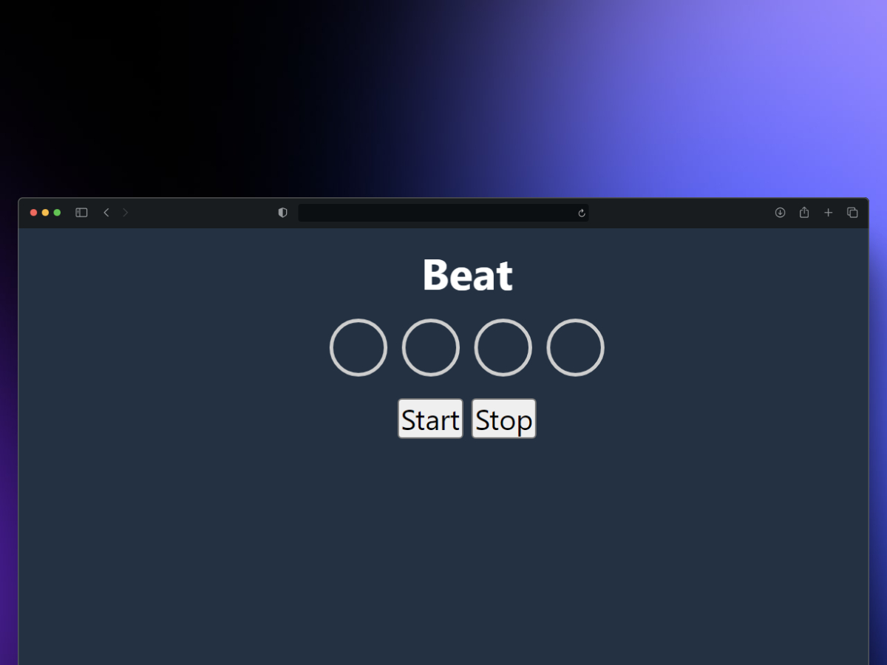

# Chess with Vanilla JS
<div align="center">   
  <a href="https://metronome-js.vercel.app/">
        ✨ Open project ✨
        <br/>
    </a>
</div>

## Start

```sh
    git clone https://github.com/pierodev0/metronome-js.git
```




This project involves creating a simple beat generator using pure JavaScript (Vanilla JS), HTML, and CSS. It demonstrates how to create interactive functionality without relying on external libraries or frameworks.

### Description
The application features a beat visualizer where div elements light up in succession when the timer is started. Users can start and stop the beat at any time. The design adjusts to user interactions and provides immediate feedback.

